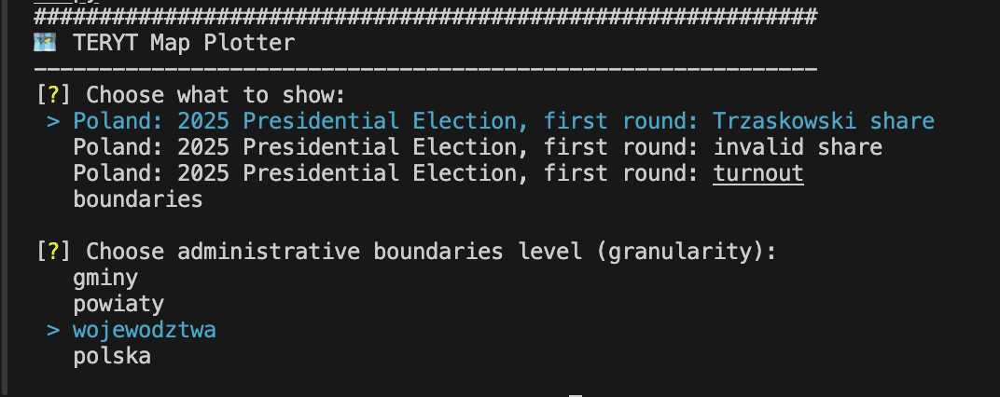
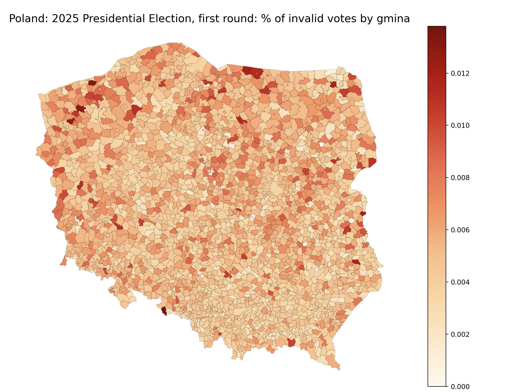

# 🌍 Statistical Map Viewer: Polish Administrative Boundaries & Beyond

A flexible tool to **visualize administrative boundaries** and **merge them with statistical data** (e.g. voter turnout, population, economic indicators). Initially built for Poland, this app supports:

- 🟢 Gmina (commune/municipality)
- 🟠 Powiat (district/county)
- 🔵 Województwo (province/voivodeship)
- ⚪ Country-level overview (e.g. Polska)

But it's designed to **scale to other countries and datasets**.

---

## 🖼️ Example: CLI and Invalid Votes Map

Below is an example of how the interactive CLI prompt works using `click` and `inquirer`, followed by the resulting map for **invalid vote share by gmina**.

### 🖱️ CLI Prompt Flow
This is what the user sees when running the app:



### 📊 Map Output: Invalid Votes
The result of selecting "invalid vote share" for gminy:



---


## ✨ Features

- Visualize boundaries without data ("outline view")
- Merge with statistical datasets via TERYT or other region codes
- Custom preprocessing for regions (e.g. Warszawa aggregation)
- Clean map rendering for analysis or reports
- CLI to explore & plot available configs
- Built-in views: **voter turnout**, **invalid vote %**, **candidate support (Trzaskowski)**

---

## 📦 Step 1: Install Dependencies

```bash
pip install -r requirements.txt
```

---

## 📁 Step 2: Download Shapefiles

Download shapefiles for Polish administrative boundaries from:  
📎 [GIS Support – Granice Administracyjne](https://gis-support.pl/baza-wiedzy-2/dane-do-pobrania/granice-administracyjne/)

Each level (`gminy`, `powiaty`, etc.) comes as a bundle of files (`.shp`, `.shx`, `.dbf`, etc.). Keep them grouped and named consistently.

Put them in `gis_boundaries/` like this:

```
gis_boundaries/
├── gminy/
│   ├── gminy.shp
│   ├── gminy.dbf
│   └── ...
├── powiaty/
│   ├── powiaty.shp
│   └── ...
├── wojewodztwa/
│   ├── wojewodztwa.shp
│   └── ...
├── polska/
│   ├── polska.shp
│   └── ...
```

---

## 🚀 Step 3: Run the Map Plotter App

Launch the interactive map generator:

```bash
python plot_it.py
```

You’ll be prompted to choose:
- A **view** (e.g. turnout, invalid share, Trzaskowski support)
- An **administrative level** (e.g. gmina, powiat, etc.)

The app will:
- Load the matching shapefile
- Optionally merge a dataset
- Plot a color-coded map

---

## 📊 Step 4: Built-in Statistical Views

The following predefined views are included:

| View Name                     | Description                                          |
|------------------------------|------------------------------------------------------|
| **Voter turnout**            | % of eligible voters who cast a vote                |
| **Invalid vote share**       | % of invalid votes relative to valid votes          |
| **Trzaskowski vote share**   | % of valid votes cast for Rafał Trzaskowski         |
| **Outline only**             | Pure boundary shapes with no statistical overlay    |

Each view supports all levels:
- POLSKA
- WOJEWODZTWA
- POWIATY
- GMINY

---

## 🌐 Config-Driven Architecture

All views are defined in `LEVEL_CONFIGS`, which merges reusable definitions:
- `process_configs/boundaries.py` – static boundary views
- `process_configs/` election or dataset-specific configs (e.g. `poland_2025_presidential_first_round.py`)

This keeps logic cleanly separated from CLI or plotting code.

---

## 🔍 Optional: Preview a Shapefile

Use this snippet (or `check_boundaries.py`) to test if shapefiles are valid:

```python
import geopandas as gpd
import os
import matplotlib.pyplot as plt

valid_levels = ["gminy", "powiaty", "wojewodztwa", "polska"]
level = "gminy"  # change to your level

if level not in valid_levels:
    raise ValueError(f"Invalid level: {level}. Must be one of {valid_levels}")
gdf = gpd.read_file(shapefile_path)

print(gdf.head())

# Try to guess TERYT column
teryt_candidates = [col for col in gdf.columns if "KOD" in col or "TERYT" in col.upper()]
if teryt_candidates:
    print(f"✅ Found TERYT-like column(s): {teryt_candidates}")
else:
    print("❌ No TERYT column found. Available columns:", gdf.columns)

# Plot
gdf.plot(edgecolor='black', figsize=(10, 10))
plt.title(f"Polish {level.capitalize()} - Boundary Preview")
plt.axis("off")
plt.show()
```

---

## 📃 Coming Soon

- Upload your own CSV and merge on region codes
- Add support for other countries and naming systems
- Custom color schemes
- Export maps as PNG/SVG/PDF

---

## 📚 Example Use Cases

- 🗳️ **Elections:** turnout, invalid votes, candidate results
- 🧑‍🤝‍🧑 **Demographics:** population structure, migration
- 💸 **Economics:** employment, income, taxation
- 🏥 **Healthcare & education:** access and infrastructure

This isn't just a Polish viewer — it's a **framework for geographic statistical visualization**.

---

**💡 Contributions welcome!**  
Have feedback or ideas? Found a regional dataset to integrate? Feel free to fork or open an issue!